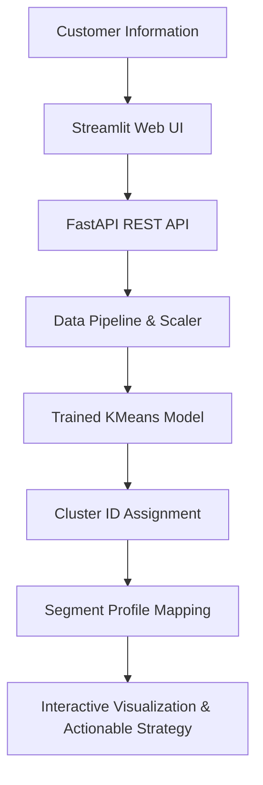

# 🛍️ Customer Segmentation ML Engine & Interactive Dashboard

> An end-to-end Machine Learning web application that groups retail customers into distinct behavioral segments to drive targeted marketing and business growth.

---

## 📌 About the Project

This project is a complete, production-ready Machine Learning system designed to segment retail customers based on their financial history, shopping habits, and promotion engagement. 

Instead of treating all customers identically, businesses can use this system to identify key customer personas—such as **High Value Customers** and **Budget Customers**—and tailor marketing strategies accordingly.

The system is delivered as a containerized web application featuring an interactive Streamlit UI, a fast RESTful API powered by FastAPI, and a secure Nginx reverse proxy hosted on AWS EC2.

---

## 💡 Business Problem

Businesses often serve thousands of customers daily, but not all customers behave the same way:
* Some customers spend thousands of dollars per year and respond to premium offers.
* Others shop strictly during sales or make infrequent, budget-friendly purchases.

Treating all customers with the exact same marketing campaign leads to wasted budgets, lower conversion rates, and spam fatigue. This project solves that problem by automatically organizing customers into meaningful groups based on patterns in their data.

---

## 🎯 The Solution

This system automates the customer segment discovery process:

```text
Customer Input Data
       │
       ▼
Data Cleaning & Feature Preprocessing
       │
       ▼
Feature Scaling & Normalization
       │
       ▼
KMeans Clustering Model
       │
       ▼
Assigned Customer Segment & Persona Profile
       │
       ▼
Interactive Web Dashboard Response
```

---

## 🔄 Project Workflow



---

## 🛠️ Technologies Used

| Technology | Why It Was Used |
| :--- | :--- |
| **Python** | Core programming language for data processing and model training. |
| **Scikit-Learn** | Machine Learning library used for data preprocessing and KMeans clustering. |
| **FastAPI** | High-performance Python backend framework providing RESTful prediction endpoints. |
| **Streamlit** | Modern, interactive Python web framework for building the dashboard interface. |
| **Docker & Docker Compose** | Containerization tool to package UI, API, and Nginx into reproducible services. |
| **Nginx** | Production-ready reverse proxy handling routing, Gzip compression, and WebSockets. |
| **MongoDB** | NoSQL database used to store historical predictions and customer data logs. |
| **AWS EC2** | Cloud virtual server hosting the containerized application on Ubuntu Linux. |

---

## 🧠 Machine Learning Model

### What is KMeans Clustering?
Imagine placing a variety of fruits on a table. Without knowing their names, you can easily group them by color, size, and texture. 

**KMeans Clustering** works the same way for data. It is an *unsupervised learning algorithm* that automatically groups similar items (customers) together based on mathematical distance between their features (income, spending, web visits).

### Why KMeans?
* **No Manual Labels Needed**: It finds hidden patterns without needing pre-classified labels.
* **Fast and Scalable**: It computes customer clusters rapidly, making it ideal for real-time web applications.
* **Interpretable Results**: Output groups directly map to clear business personas.

---

## 📐 Choosing the Optimal Number of Clusters (Why K = 2)

To find the optimal number of groups (K), we used the **Elbow Method**:

1. We trained the KMeans model with different values of $K$ (from 1 to 10 clusters).
2. We measured the *Sum of Squared Errors (SSE)*—the distance between customers and their group center.
3. As $K$ increases, error decreases. The point where the error curve bends sharply (like an elbow) represents the ideal balance between simplicity and accuracy.

In our analysis, $K = 2$ produced a distinct, sharp elbow, separating customers into two primary operational segments: **High Value Customers** and **Budget Customers**.

---

## 📊 Model Results & Visualizations

### 1. Elbow Method Curve

*Shows the SSE error drop across different cluster counts, highlighting the optimal elbow point at $K = 2$.*

### 2. Customer Cluster Distribution

*Visualizes how customer groups split clearly across total spending and annual income levels.*

### 3. Principal Component Analysis (PCA) 2D Projection

*Reduces multi-dimensional customer features into a clean 2D plane to verify distinct cluster boundaries.*

---

## 📱 Application Screenshots

### 1. Dashboard Homepage

*The main user interface where users input customer financial details, purchase recency, and promotional history.*

### 2. Live Prediction & Business Strategy Output

*Displays predicted segment, customer persona details, and recommended marketing actions in real time.*

---

## 🏗️ Project & Deployment Architecture

### User Flow Architecture
```text
User ──► Streamlit Interface ──► FastAPI Backend ──► Preprocessor ──► KMeans Model ──► Output
```

### Production Deployment Architecture (Nginx + Docker)
```text
                       Internet (Port 80)
                               │
                               ▼
                    Nginx Reverse Proxy (Port 80)
                               │
            ┌──────────────────┴──────────────────┐
            │                                     │
            ▼                                     ▼
Streamlit Frontend (Port 8501)       FastAPI Backend (Port 8000)
 (customer_segmentation_ui)          (customer_segmentation_api)
```

---

## 🌐 Live Application Links

* 🛍️ **Interactive Web Application**: `http://<YOUR_EC2_PUBLIC_IP>`
* 📚 **FastAPI Swagger API Documentation**: `http://<YOUR_EC2_PUBLIC_IP>/docs`

*(Replace `<YOUR_EC2_PUBLIC_IP>` with your AWS EC2 instance's public IP address).*

---

## 📁 Repository Folder Structure

```text
Customer-Segmentation-Project/
├── app.py                   # FastAPI backend application & API routes
├── Homepage.py              # Main Streamlit web dashboard entry point
├── common_theme.py          # Shared UI theme, custom styling, and layout components
├── nginx.conf               # Production Nginx reverse proxy configuration
├── docker-compose.yml       # Multi-container orchestration (Nginx, Backend, Frontend)
├── Dockerfile               # Container build blueprint
├── requirements.txt         # Project Python dependencies
├── images/                  # Screenshots and visualization assets
├── pages/                   # Additional Streamlit multipage views
└── src/
    ├── pipeline/            # Training and prediction execution pipelines
    ├── components/          # Data ingestion, transformation, and model trainer
    └── utils/               # Helper utilities and MongoDB connectors
```

---

## 🚀 How to Run Locally

### Prerequisites
* [Docker Desktop](https://www.docker.com/products/docker-desktop/) installed and running.
* [Git](https://git-scm.com/) installed.

### Step-by-Step Setup

1. **Clone the Repository**
   ```bash
   git clone https://github.com/papocun/Customer-Segmentation-Project.git
   cd Customer-Segmentation-Project
   ```

2. **Launch with Docker Compose**
   ```bash
   docker compose up --build -d
   ```

3. **Access the Application**
   * Open your web browser and navigate to: `http://localhost`
   * Access API documentation at: `http://localhost/docs`

4. **Stop the Application**
   ```bash
   docker compose down
   ```

---

## 🔮 Future Improvements

* [ ] **Automated Retraining Pipeline**: Schedule weekly model retraining as new customer transactional data arrives.
* [ ] **SSL/TLS Certificate Integration**: Configure Let's Encrypt with Certbot for HTTPS security.
* [ ] **Advanced Customer Personas**: Expand clustering ($K=4$ or $K=5$) to isolate "Churn Risk" and "Occasional Bargain Hunters".
* [ ] **Automated CI/CD Pipeline**: Set up GitHub Actions for continuous integration and automated EC2 deployment.
* [ ] **User Authentication**: Implement JWT-based login for marketing team access control.

---

## 🎓 Key Learnings

Building this end-to-end Machine Learning system provided hands-on engineering experience in:
1. **Unsupervised ML**: Understanding clustering algorithms, data normalization, and Elbow evaluation metrics.
2. **API Design**: Building robust, asynchronous FastAPI prediction endpoints with Pydantic validation schemas.
3. **Containerization**: Writing modular Dockerfiles and orchestrating multi-container environments using Docker Compose.
4. **Cloud Infrastructure**: Provisioning AWS EC2 Ubuntu instances, managing Security Group firewall rules, and handling remote deployments.
5. **Reverse Proxy & DevOps**: Configuring Nginx to handle WebSockets, Gzip asset compression, security headers, and single-port routing.
