# 🛍️ Customer Segmentation ML Engine & Dashboard

> 🌐 **Live EC2 Deployment**: [http://16.171.71.103/](http://16.171.71.103/)

An end-to-end Machine Learning web application that segments retail customers based on financial history, spending behavior, and promotional engagement using **FastAPI**, **Streamlit**, **KMeans Clustering**, and **MongoDB**. Fully containerized with **Docker** and reverse-proxied via **Nginx** on **AWS EC2**.

---

## ⚙️ Project Architecture & Detailed Workflow

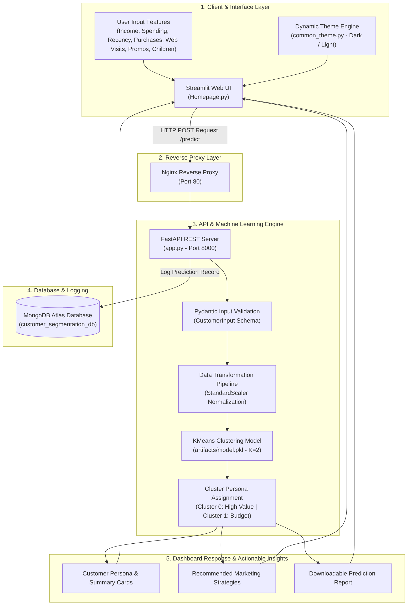

---

## 🖼️ Application Interface (Light & Dark Mode)

<div align="center">

| ☀️ Light Mode | 🌙 Dark Mode |
| :---: | :---: |
| 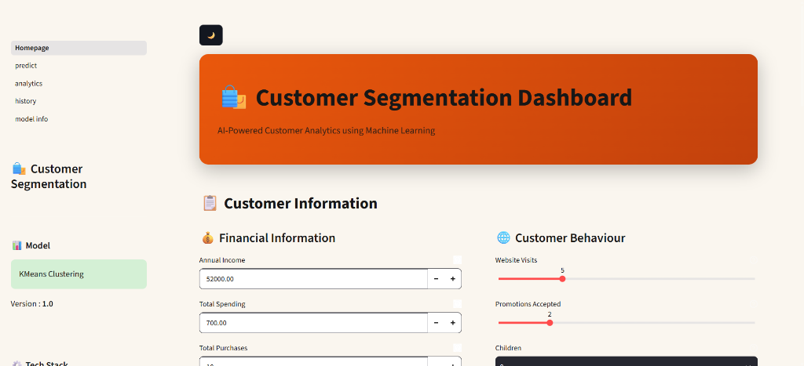 | 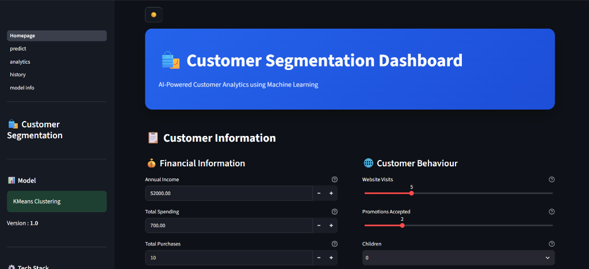 |
| 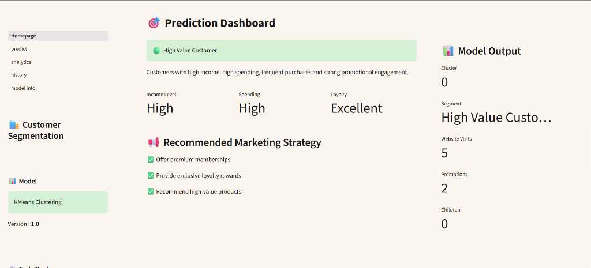 | 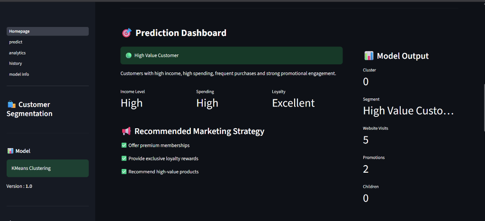 |
| 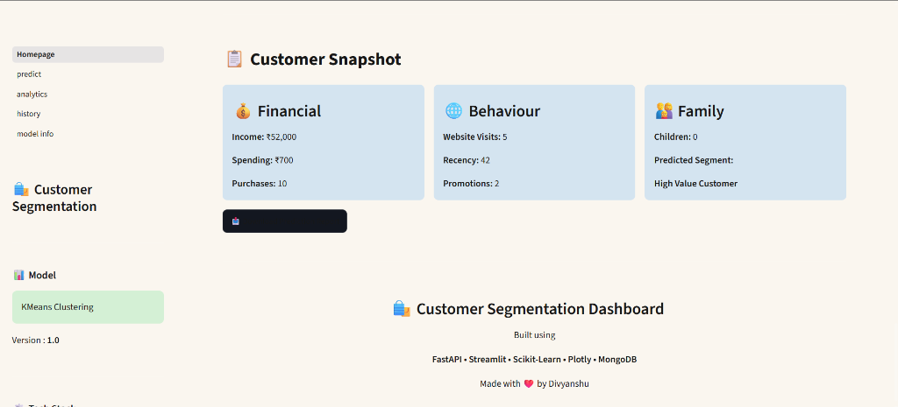 | 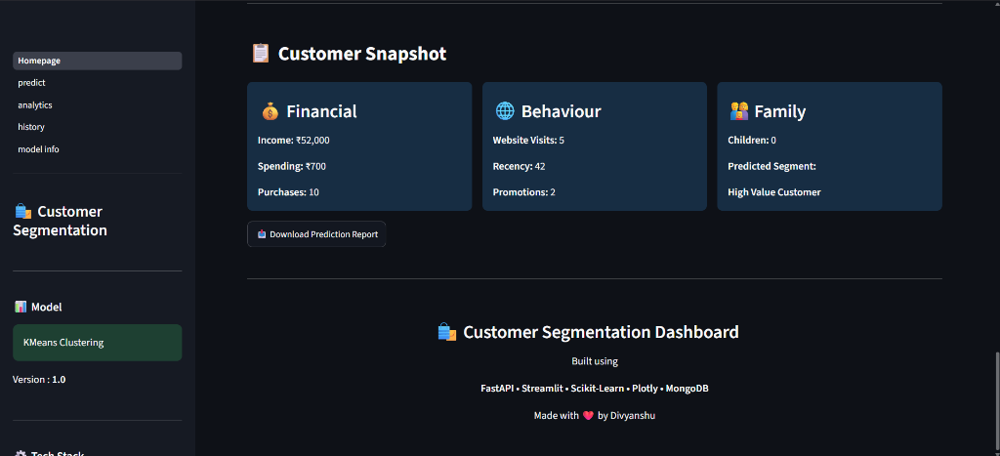 |

</div>

---

## 🧠 Machine Learning Model & Cluster Analysis

The engine uses **KMeans Clustering** ($K=2$) to segment customers into distinct behavioral groups based on financial metrics, purchase patterns, and promotional engagement.

### 1. Optimal Cluster Evaluation (Elbow & Silhouette Methods)

<div align="center">

| 📈 Elbow Method (Inertia vs K) | 📊 Silhouette Score Evaluation |
| :---: | :---: |
| 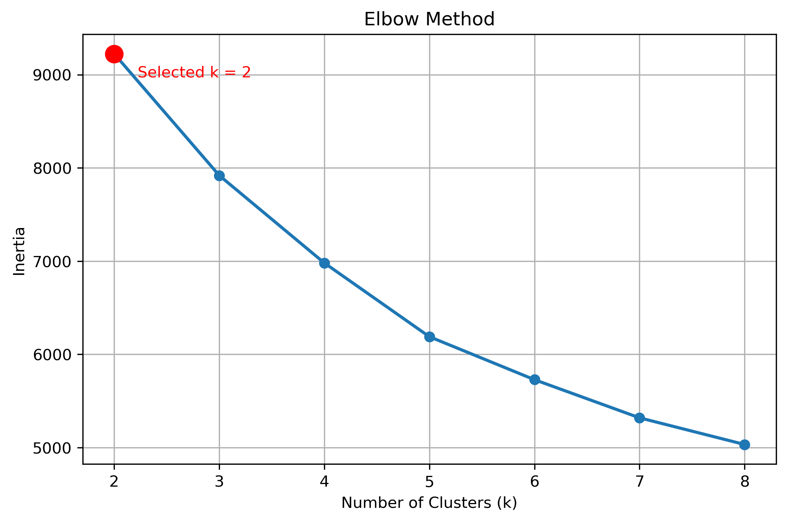 | 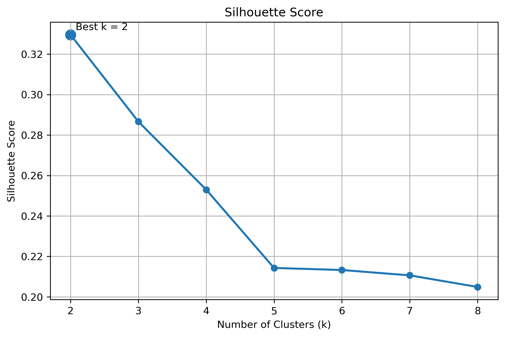 |

</div>

* **Elbow Method**: Highlights the optimal bend at $K=2$, balancing inertia and cluster count.
* **Silhouette Analysis**: Confirms maximum cluster separation quality at $K=2$.

### 2. Cluster Visualization & PCA Projection

<div align="center">

| 🛍️ Income vs Spending Distribution | 🌀 2D PCA Cluster Projection |
| :---: | :---: |
| 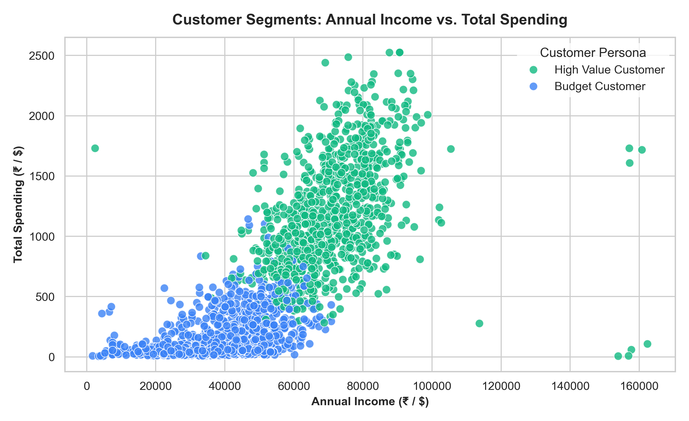 | 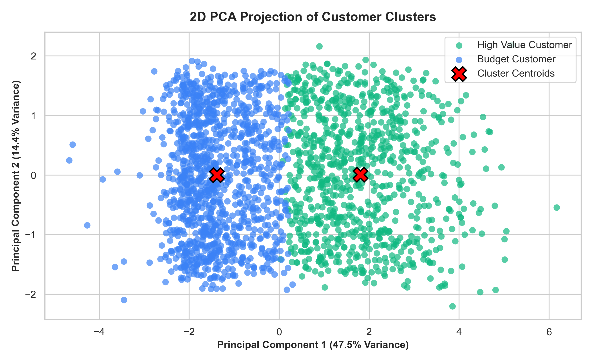 |

</div>

* **Cluster 0 (High Value Customer)**: High income, high spending, frequent purchases, high promotional response.
* **Cluster 1 (Budget Customer)**: Lower spending, fewer purchases, lower promotional engagement.

---

## 🛠️ Tech Stack

| Component | Technology |
| :--- | :--- |
| **Frontend** | Streamlit, Plotly, HTML/CSS |
| **Backend API** | FastAPI, Pydantic, Uvicorn |
| **ML Engine** | Scikit-Learn (KMeans, StandardScaler), Pandas, NumPy |
| **Database** | MongoDB Atlas |
| **Containerization** | Docker, Docker Compose |
| **Reverse Proxy** | Nginx |
| **Cloud Host** | AWS EC2 (Ubuntu Linux) |

---

## 🚀 Quick Start (Local Setup)

1. **Clone the Repository**
   ```bash
   git clone https://github.com/papocun/Customer-Segmentation-Project.git
   cd Customer-Segmentation-Project
   ```

2. **Run with Docker Compose**
   ```bash
   docker compose up --build -d
   ```

3. **Access Service**
   * **Streamlit UI**: `http://localhost:8501`

---

## 🔮 Future Scope & Planned Features

* 📌 **Multipage Dashboard Extensions**: Implementation of remaining sidebar views (`predict`, `analytics`, `history`, `model info`).
* 📌 **Hyperparameter Tuning**: Automated grid search for cluster optimization and silhouette metric evaluation across $K > 2$.
* 📌 **Automated Model Retraining**: Continuous retraining pipeline triggered by new incoming MongoDB transaction logs.
* 📌 **Advanced Clustering Algorithms**: Experimentation with DBSCAN and Hierarchical Agglomerative Clustering.
* 📌 **User Authentication**: Role-based access control (RBAC) for marketing teams.
