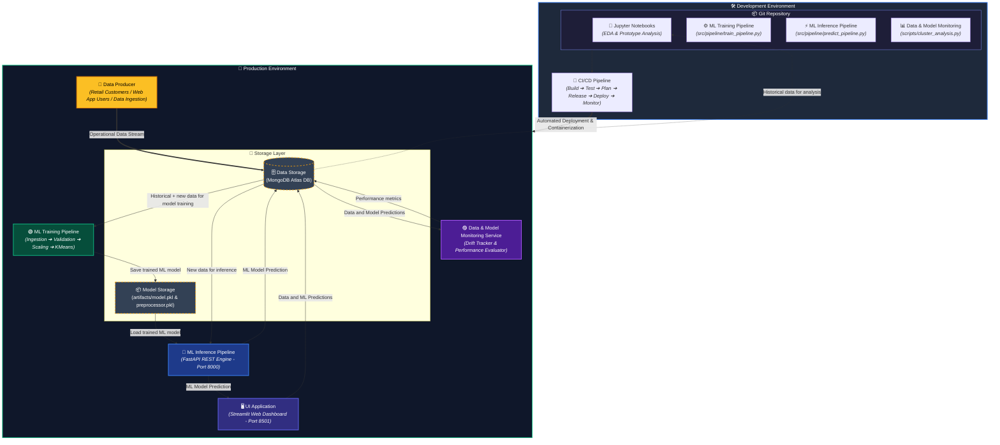

# 🛍️ Customer Segmentation ML Engine & Dashboard (MLOps Architecture)

> 🌐 **Live EC2 Deployment**: [http://16.171.71.103/](http://16.171.71.103/)

An end-to-end, enterprise-grade **Machine Learning MLOps web application** designed to segment retail customers dynamically based on financial history, spending behavior, and promotional engagement. Powered by **FastAPI**, **Streamlit**, **KMeans Clustering ($K=2$)**, **Scikit-Learn**, and **MongoDB Atlas**, containerized with **Docker**, and orchestrated via **Nginx Reverse Proxy** on **AWS EC2**.

---

## ⚙️ MLOps System Architecture & Workflow

The architecture below illustrates the complete **End-to-End MLOps Lifecycle**, divided into the **Development Environment** (versioning, training code, inference logic, monitoring scripts, CI/CD) and the **Production Environment** (live data storage, automated training pipeline, model storage, REST API inference, UI dashboard, and performance monitoring).



---

## 🔍 Detailed Component & Data Flow Breakdown

### 🛠️ 1. Development Environment
* **Git Repository**: Stores source code, modular MLOps pipelines (`src/`), exploratory notebooks (`Notebooks/`), and diagnostic scripts (`scripts/`).
  * **Jupyter Notebooks**: Used by data scientists for initial data cleaning, feature engineering, Elbow/Silhouette evaluations, and model experimentation. Pulls historical data directly from **Data Storage**.
  * **ML Training Pipeline Code** (`src/pipeline/train_pipeline.py`): Encapsulates data ingestion, schema validation (`data_validation.py`), standard scaling transformation (`data_transformation.py`), and model fitting (`model_trainer.py`).
  * **ML Inference Pipeline Code** (`src/pipeline/predict_pipeline.py`): Logic to load serialized artifacts and perform real-time model inference on incoming customer payloads.
  * **Data & Model Monitoring Scripts** (`scripts/cluster_analysis.py`, `cluster_profiling.py`): Evaluates cluster centroids, drift metrics, and feature distribution across iterations.
* **CI/CD Pipeline**: GitHub Actions / Automated Container Integration:
  * Triggers automated linting, schema testing, and unit tests upon new code commits.
  * Builds multi-stage Docker images for backend (`FastAPI`), frontend (`Streamlit`), and reverse proxy (`Nginx`).
  * Deploys containerized updates seamlessly to the **Production Environment** (AWS EC2 / Elastic Beanstalk).

---

### 🚀 2. Production Environment
* **Data Producer**: Captures real-time customer interactions, manual batch entries from web clients, or upstream retail transactional engines, feeding raw operational records directly to **Data Storage**.
* **Data Storage (`MongoDB Atlas`)**: Centralized cloud database (`customer_segmentation_db`).
  * Serves historical datasets for continuous model re-training.
  * Stores user submission payloads, prediction logs, and generated customer cluster labels.
  * Receives evaluation performance metrics from the monitoring service.
* **ML Training Pipeline (Production Execution)**:
  * Ingests combined historical and newly logged customer records from **Data Storage**.
  * Performs data preprocessing and standard scaling (`StandardScaler`).
  * Trains the optimal **KMeans Clustering** model.
  * Serializes and saves updated model weights (`model.pkl`) and scaler transformations (`preprocessor.pkl`) into **Model Storage**.
* **Model Storage (Artifact Registry)**:
  * Holds versioned model artifacts under `artifacts/` (`model.pkl`, `preprocessor.pkl`).
  * Serves as the single source of truth for trained machine learning models used in live inference.
* **ML Inference Pipeline (`FastAPI REST Backend`)**:
  * Hosted via **Uvicorn** on port 8000 (`app.py`).
  * Dynamically loads serialized models from **Model Storage**.
  * Validates incoming request payloads via **Pydantic** (`CustomerInput`).
  * Transforms raw input features using `preprocessor.pkl` and predicts cluster assignments.
  * Returns JSON responses containing predicted cluster IDs, persona names, and actionable marketing descriptions.
* **UI Application (`Streamlit Web Dashboard`)**:
  * Front-facing interactive dashboard (`Homepage.py` & `pages/`) served on port 8501.
  * Features a custom dynamic light/dark theme engine (`common_theme.py`).
  * Collects customer metrics (`Income`, `Spending`, `Purchases`, `Recency`, `Web Visits`, `Promos`, `Children`).
  * Communicates via HTTP requests (`/predict`) to the backend inference service via **Nginx** proxy (port 80).
  * Displays cluster summary cards, strategic marketing recommendations, and downloadable PDF/CSV reports.
* **Data & Model Monitoring Service**:
  * Continuously evaluates real-time data distributions stored in **Data Storage**.
  * Measures data drift, cluster variance, and silhouette stability over time.
  * Writes calculated **Performance Metrics** back into **Data Storage** to trigger automated model retraining when performance thresholds drop.

---

## 📊 Data Dictionary & Input Feature Specification

| Feature Name | Type | Description |
| :--- | :--- | :--- |
| **Income** | `Float` | Annual household income in USD. |
| **Total_Spending** | `Float` | Cumulative monetary expenditure across product categories. |
| **Total_Purchases** | `Float` | Total count of store, web, and catalog transactions. |
| **Recency** | `Integer` | Days passed since last recorded purchase. |
| **NumWebVisitsMonth** | `Integer` | Number of visits to the company web platform in the last month. |
| **Total_Promo_Accepted** | `Integer` | Count of marketing campaign promotions accepted. |
| **Children** | `Integer` | Total number of dependent children in household. |

---

## 🎯 Customer Segment Personas

| Cluster ID | Segment Name | Target Profile & Behavioral Patterns | Actionable Marketing Strategy |
| :---: | :--- | :--- | :--- |
| **Cluster 0** | 🌟 **High Value Customer** | High annual income, high spending, frequent purchases across channels, strong responsiveness to marketing campaigns. | Exclusive VIP loyalty programs, early product access, high-tier rewards, premium upsell packages. |
| **Cluster 1** | 💡 **Budget Customer** | Moderate/lower income, price-sensitive spending, fewer transaction counts, lower promotional engagement. | Discount coupons, bulk buy offers, value-oriented email promotions, entry-level product bundles. |

---

## 🖼️ Application Interface (Light & Dark Mode Showcase)

<div align="center">

| ☀️ Light Mode UI | 🌙 Dark Mode UI |
| :---: | :---: |
|  |  |
|  |  |
|  |  |

</div>

---

## 🧠 Machine Learning Model & Cluster Analysis

The core engine uses **KMeans Clustering** evaluated via Inertia (Elbow Method) and Silhouette Coefficient metrics to determine optimal cluster granularity ($K=2$).

<div align="center">

| 📈 Elbow Method (Inertia Curve) | 📊 Silhouette Score Evaluation |
| :---: | :---: |
|  |  |

| 🛍️ Income vs Spending Distribution | 🌀 2D PCA Cluster Projection |
| :---: | :---: |
|  |  |

</div>

---

## 📂 Repository File & Directory Structure

```
Customer Segmentation Project/
├── .github/ workflows/          # CI/CD automation pipelines
├── artifacts/                   # Model Storage (Serialized ML models & scalers)
│   ├── model.pkl                # Trained KMeans model artifact
│   └── preprocessor.pkl         # StandardScaler transformer artifact
├── config/                      # Configuration YAML / environment configs
├── data/                        # Datasets (raw & preprocessed)
├── images/                      # Documentation UI screenshots & cluster plots
├── logs/                        # System log files
├── Notebooks/                   # Jupyter Notebooks for EDA & experimentations
├── pages/                       # Multi-page Streamlit views (analytics, history, etc.)
├── scripts/                     # Cluster analysis, evaluation & profiling scripts
│   ├── cluster_analysis.py      # Centroid & drift evaluation script
│   └── generate_cluster_plots.py # Plot generation utility
├── src/                         # Core Python Modular MLOps Library
│   ├── components/              # Pipeline stages
│   │   ├── data_ingestion.py    # MongoDB / CSV Data Ingestion component
│   │   ├── data_validation.py   # Schema & Null Check validation
│   │   ├── data_transformation.py # Preprocessing & StandardScaling
│   │   └── model_trainer.py     # KMeans training & artifact saving
│   ├── pipeline/                # End-to-End Execution Pipelines
│   │   ├── train_pipeline.py    # Full Training Pipeline Orchestrator
│   │   └── predict_pipeline.py  # Inference Pipeline for FastAPI
│   ├── data_access/             # MongoDB database connections
│   ├── entity/                  # Dataclass artifacts & configurations
│   ├── exception.py             # Custom Exception Handling
│   └── logger.py                # Logging system configuration
├── app.py                       # FastAPI Application Backend Server
├── Homepage.py                  # Streamlit Web UI Main Entrypoint
├── common_theme.py              # Dynamic Theme Engine (Light / Dark Mode CSS)
├── nginx.conf                   # Nginx Reverse Proxy Configuration
├── Dockerfile                   # Multi-stage Docker build configuration
├── docker-compose.yml           # Multi-container orchestrator (API, UI, Nginx)
├── Dockerrun.aws.json           # AWS Elastic Beanstalk multi-container deployment
├── requirements.txt             # Python project dependencies
└── Readme.md                    # Project Documentation
```

---

## 🛠️ Tech Stack & Infrastructure

| Layer | Technology | Usage Description |
| :--- | :--- | :--- |
| **Frontend UI** | Streamlit, Plotly, HTML/CSS | Interactive user dashboard, visualizations, and dynamic dark/light theme |
| **Backend API** | FastAPI, Pydantic, Uvicorn | High-performance asynchronous REST API serving `/predict` endpoint |
| **ML Framework** | Scikit-Learn, Pandas, NumPy | KMeans Clustering, StandardScaler, PCA dimension reduction |
| **Database Storage**| MongoDB Atlas DB | Cloud NoSQL persistence for training data and inference logs |
| **Model Registry** | Local Artifact Store (`.pkl`) | Serialized machine learning models and data preprocessing pipelines |
| **Containerization**| Docker, Docker Compose | Multi-container encapsulation (`backend`, `frontend`, `nginx`) |
| **Reverse Proxy** | Nginx (Port 80) | Port routing, load balancing, and header proxying to inner services |
| **Cloud Hosting** | AWS EC2 (Ubuntu Linux) | Live server deployment hosted on AWS cloud infrastructure |


## 🔮 MLOps Roadmap & Future Scope

* 📌 **Automated Continuous Training (CT)**: Trigger model training automatically when data drift metrics exceed defined thresholds in MongoDB logs.
* 📌 **MLflow / SageMaker Integration**: Upgrade Model Storage to an enterprise registry with experiment tracking and model lineage.
* 📌 **Hyperparameter Optimization**: Automated Silhouette & Calinski-Harabasz score grid search across higher cluster counts ($K > 2$).
* 📌 **RBAC User Authentication**: Add JWT multi-tenant authentication for enterprise marketing teams.
* 📌 **Advanced Clustering Algorithms**: Implement DBSCAN & Agglomerative Hierarchical Clustering comparison modules.
